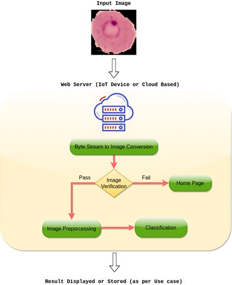

# Mosquito-Net
Source Code for "MOSQUITO-NET: A Deep Learning based CADx system for malaria diagnosis along with model interpretation using GradCam and class activation maps."

 

 
## About the project

This repository hosts the source code of **MOSQUITO-NET: A Deep Learning based CADx system for malaria diagnosis along with model
interpretation using GradCam and CLass activation maps.**
This work
has been published in [Expert Systems](https://onlinelibrary.wiley.com/journal/14680394).

Automatic classification of malaria infected blood smears deep learning approaches can
be performed using the framework available here:
<https://malaria.zyik.ml/>.

The project is live at https://zyik.ml/
